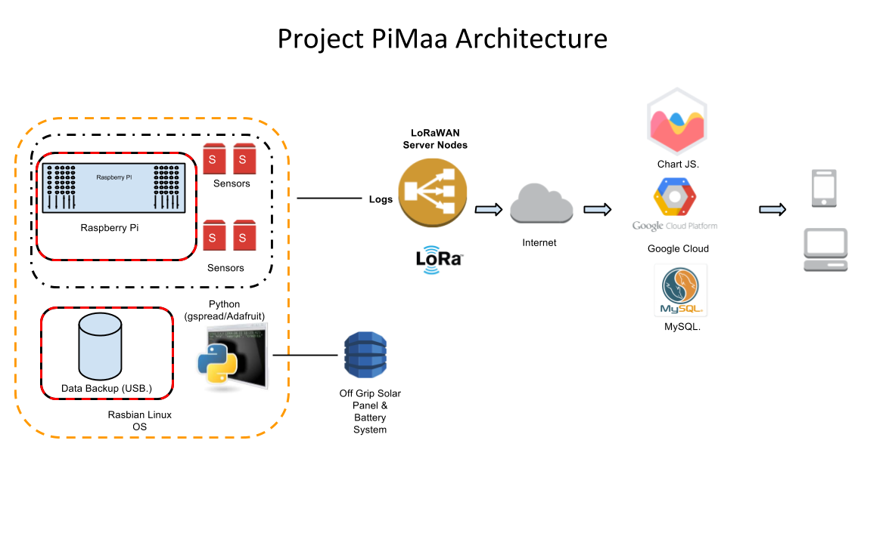

## **High-Level Technical Overview of "Project PiMaa" or “PiMa Things”**

## **(Environmental Monitoring system)**

September, 2016

## **Project ****PiMaa**

*There is a need for a robust, economical and extendable system for measuring the environment in the city of Kampala, Uganda that is low cost, modular and open source.*

*
*The Project PiMaa platform (PiMa or Okupima, is a Luganda word that means "to measure") is designed around the Raspberry Pi as the core of the system that is used to measure several environmental conditions ranging from temperature, humidity, light or UV,  air pressure, Nitrogen dioxide, Carbon Dioxide levels etc. To be scalable with such a system, the cost becomes a major issue. Also the need to have an implementation that is based on open source technologies and with modular reconfigurable sensors that can be distributed across wide areas is a plus. Finally, the data needs to be fully accessible remotely anywhere on the web and visualized in a format that can be easily interpreted to make informed decisions.

* The Project shall mostly run on low cost **Raspberry Pi****’s **as the core of the system. It is based on a Broadcom SOC (System on a Chip) that includes an ARM7 core, a Videocore iv GPU and USB controller. It has either 256MB or 512MB on the board and an SD card slot for storage. [https://www.raspberrypi.org](https://www.raspberrypi.org)

* A collection of **sensors ** that include CO and NO2 sensors, DHT22 temperature & humidity sensor, BMP085 air pressure sensor, LDR light sensor, Microphone and rail-to-rail op-amp to amplify sound signals to measure the noise pollution.

* We use **Adafruit**, a python library for accessing the BMP series sensors data. [https://github.com/adafruit](https://github.com/adafruit/Adafruit-Raspberry-Pi-Python-Code)

* We use **gspreadsheet** to send over the data to a google spreadsheet over an internet connection for more robust usage in analytics. [https://github.com/burnash/gspread](https://github.com/burnash/gspread)

* The **Google Appscript** to be used for the formatting of the data and spreadsheet formula joins or lookups. [https://developers.google.com/apps-script/](https://developers.google.com/apps-script/)

* We visualize the data in **Shiny** and **Rstats**, and as we keep and almost real time dashboard of the data that will be coming in from the different monitoring sensors. The analytics shall be web based and interactive for users to access. [http://shiny.rstudio.com](http://shiny.rstudio.com)

* **AWS Cloud** was selected and running on Linux Distro. This offers reliable, scalable, secure and inexpensive cloud computing services that fit such a project.  [https://aws.amazon.com](https://aws.amazon.com/)

* **LoRaWAN** is a new, private and spread-spectrum modulation technique which allows sending data at extremely low data-rates to extremely long ranges. The low data-rate (down to few bytes per second) and LoRaWAN modulation lead to very low receiver sensitivity (down to -136 dBm), which combined to an output power of +14 dBm means extremely large link budgets: up to 150 dB, what means more than 22 km (13.6 miles) in LOS links and up to 2 km (1.2 miles) in NLOS links in urban environment (going through buildings). We do use this technology to share our sensors data to central gateway before transferred to server through the internet. [https://www.lora-alliance.org](https://www.lora-alliance.org/)

* **Off Grid Solar power + Batteries**** **which allow our solar cell to harvest a significant amount of energy from both indoor and outdoor light to ensure sensor and Pi devices to run longer under any lighting condition. 

The code and technical design documents on all the Project PiMaa activity shall fully be open sourced ([on Github](https://github.com/outboxafrica)) under what GPLv2 licence! And extend more environmental monitoring opportunities. 

Finally with the design Architecture above, we figured some issues that will need consideration 

* Supports live notifications of failing sensors and addition or removal of sensors at any time 

* Handles missing or corrupt data

* Tolerate power outages and other upsets and consider Solar powered batteries. 

* Readings and 24-hour plots are updated every 10-30 minutes

* Consideration of Low power WAN Infrastructure e.g LoraWans etc 

Project PiMaa

Twitter: @projectpimaa 

.

